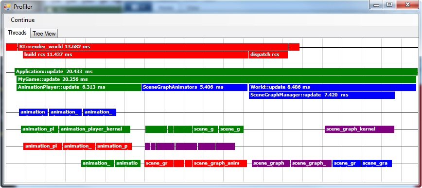

# First profiler screenshot

We now have the BitSquid thread profiler up and running. The profiler is a C# application that receives profiler events from the engine over a TCP pipe.

The screen shot above shows a screen capture from a test scene with 1 000 individually animated 90-bone characters running on a four core machine. The black horizontal lines are the threads. The bars are profiler scopes. Multiple bars below each other represent nested scopes (so `Application::update` is calling `MyGame::update` for instance). Color represents the core that the scope started running on (we do not detect core switches within scopes).

In the screen shot above, you can see `AnimationPlayer::update` starting up 10 animation_player_kernel jobs to evaluate the animations. Similarly `SceneGraphManager::update` runs five parallel jobs to update the scene graph. `SceneGraphAnimators` only copies the animation data from the animation output into the scene graphs. But even this takes some time, since we are copying 90 000 matrices.

(Of course if we would make a 1 000 people crowd in a game we would use clever instancing, rather than run 1 000 animation and scene graph evaluations. This workload was just used to test the threading.)
