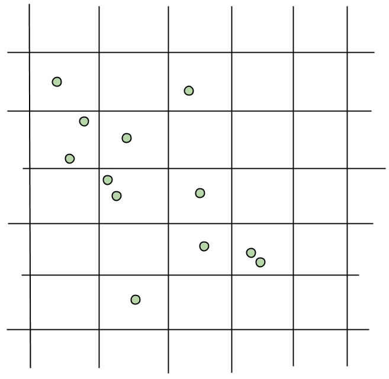
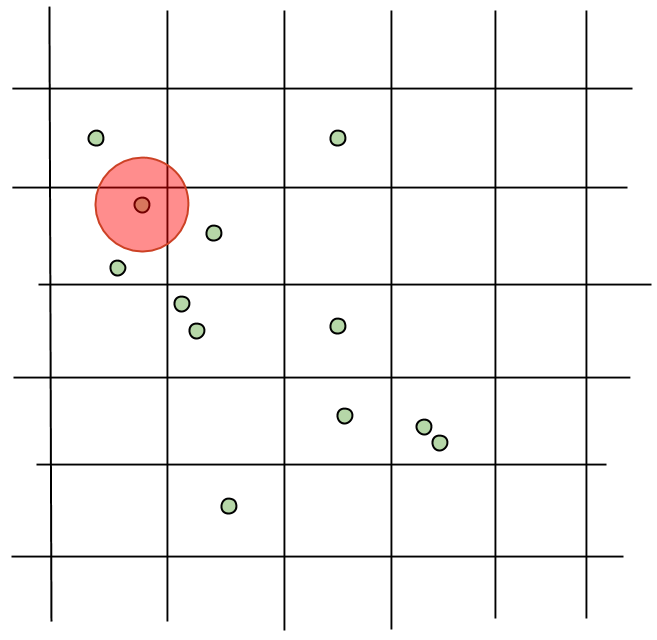
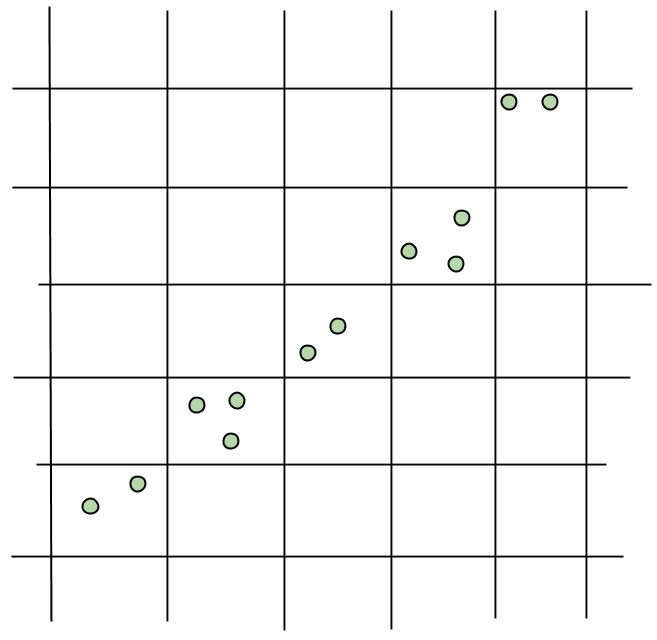

# Finding Nearby Stuff

A problem that crops up quite often in game programming is the need to find stuff that is "close to" other stuff. For example, you may want to find all enemies close to the player, all treasures close to a goblin, etc.

Most recently, I ran into this problem when I added support for merging navigation meshes to the Bitsquid engine.

To merge meshes, I need to find all the vertices that are "sufficiently close" (within some tolerance limit) in the meshes that I'm merging. These vertices should be considered "the same" in the merged mesh and need to be treated specially.

The naive algorithm for finding these coinciding vertices is to just do a double loop:

```
foreach (v1 in vertices)
   foreach (v2 in vertices)
      if (distance(v1, v2) < tolerance)
         ...
```

But since this algorithm is *O(n^2)* in the number of vertices, it is often prohibitively expensive.

To improve the performance you need some kind of data structure for accelerating spatial queries. There are lots of different possibilities. *Real-Time Collision Detection* by Christer Ericsson has a good coverage of them.

One of the simplest approaches is to use some kind of grid bucket system. You divide the world into a grid and for each grid cell you store a list of the vertices that fall in that cell. To check for "close" vertices you look through the list of vertices in your cell:



Depending on what your definition of "close" is (how big the search radius is compared to the grid size), you may need to search more cells. Note that if the search starts close enough to a grid corner you always have to search at least four cells, no matter how small the search radius is. (For a two-dimensional grid, a four-dimensional grid requires you to search eight cells.)


If you know what the search radius is going to be (for example, in my vertex merging case I always use the same merge distance) you can adapt the grid so that you never have to search more than four cells, by setting the grid size to be equal to the search diameter.



With a larger grid size you can sometimes get by with searching just one or two cells, depending on how close to a grid line the search starts, but there will always be some positions where you will have to look at four cells.

The fact that you at most have to look at four cells can be used to make an interesting variant of the algorithm. Instead of checking the four neighboring cells in the lookup, you can *store* the item in all four neighboring cells. That way you will only have to check a single cell when you do the lookup. This approach will make lookups four times faster, insertions four times slower and use four times as much memory. It can be a good optimization if you have a high ratio of lookups to insertions.

For my particular case (vertex merging) I only have one lookup per insertion, so this would not be a net win.

Designing the grid can be tricky.

How large should it be? You may need to do a pre-pass over your data to find the range, which isn't possible if you don't have all the data up front. (Letting the grid coordinates wrap around can solve this in some cases.)

How big should the cells be? If you make them too small, the grid will consume too much memory. If you make them too big, you may end up with lots of points that you need to check in each cell, which will make the algorithm slow.

What if the data is laid out on a diagonal? In this case most grid cells will be empty, wasting memory:



Most of these concerns can be fixed by not storing the grid in a traditional matrix, but instead use a hash that maps from grid coordinates to cell data:

```cpp
struct GridCoordinate {
   int x;
   int y;
};

HashMap<GridCoordinate, CellData> grid;

// To insert an item
GridCoordinate gc;
gc.x = (int)floor(p.x / cell_size);
gc.y = (int)floor(p.y / cell_size);
grid[gc] = cell_data;
```

This way, you will only use memory for the cells that actually contain data and lookups are still O(1). You also don't have to care about how big the grid is or what happens if data ends up outside the grid. In fact, you only have one parameter left to worry about, the *cell_size*.

As mentioned above, a good heuristic is to use:

```cpp
float cell_size = 1.0 * search_diameter;
```

That way you have to investigate exactly four cells in each lookup.

If the data is sparse compared to the search radius you can use a bigger cell size, which means that you don't always have to check all four neighbors. But note that the average number of cells you need to search in each lookup goes down slowly, while the cell area (and correspondingly the average number of items in each cell) grows quickly. So only use this optimization when you know that the data is sparse.

|Multiplier|Avg. cells to search|Cell area|
|---|---|---|
|1.0|4.00|1.00|
|1.5|2.78|2.25|
|2.0|2.25|4.00|
|3.0|1.78|9.00|
|5.0|1.44|25.00|
|10.0|1.21|100.00|

The final piece of this puzzle is what *CellData* should look like. It might be tempting to do something like:

```cpp
typedef Vector<VertexId> CellData;
```

However, this would be highly inefficient. In many cases cells will only contain a few items and allocating a Vector for them is total overkill. Using a Vector will mean tons of pointer chasing, cache misses and data copying.

For me, a general rule of thumb when writing high performance C++ code is to avoid collections stored inside other collections. If you store collections in collections it is very easy to create innocuous looking code that does tons of data copying behind your back.

So what can you do instead. If you have a good *MultiHashMap* implementation, you can use that. Otherwise, you can do something like this:

```cpp
struct CellData {
   VertexId id;
   unsigned next;
};
Array<CellData> items;
```

Here, *items* contains linked lists of the items in each cell, stored in a continuous array (which is the only sane way to store linked lists). The *HashMap* gives the first cell item. Then you follow the *next* references in the *items* list to find subsequent items in the same cell until *next == UINT_MAX*, which marks the end of the list.

This basic pattern: grid coordinates -> hash map -> linked list in array is my standard go-to solution for making spatial queries. It is straightforward, easy to understand and uses memory reasonably while providing O(1) lookups.
